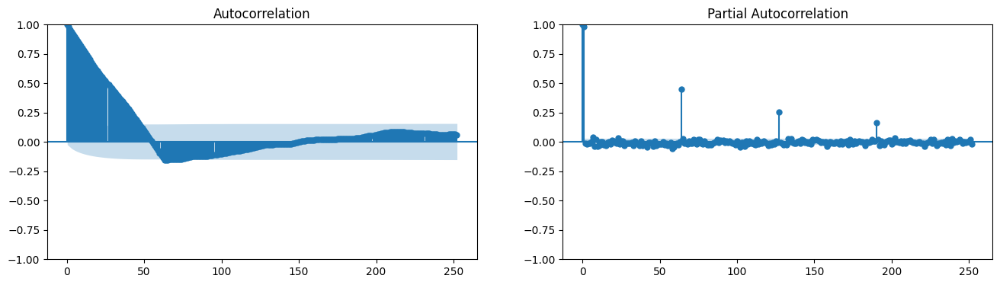
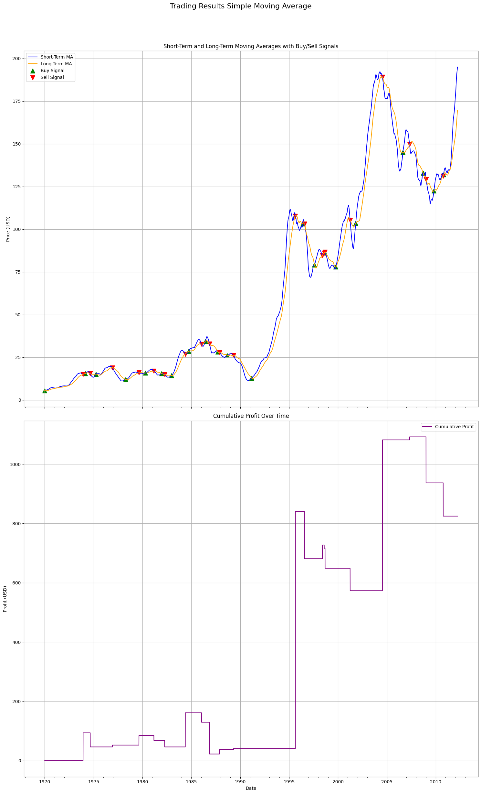
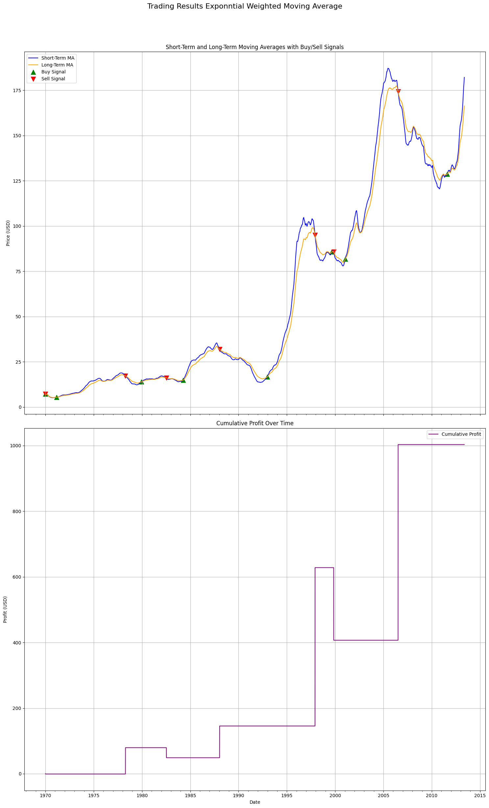
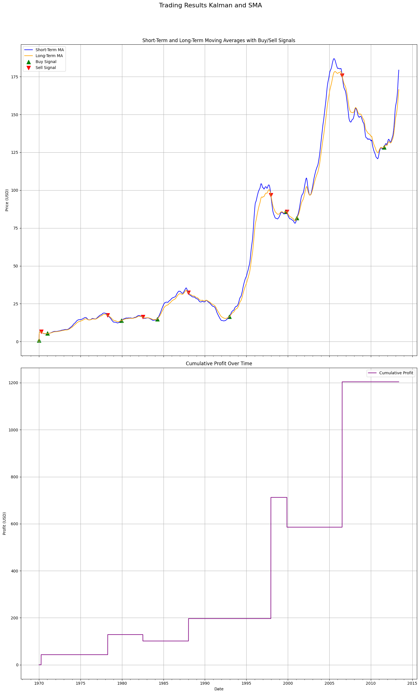
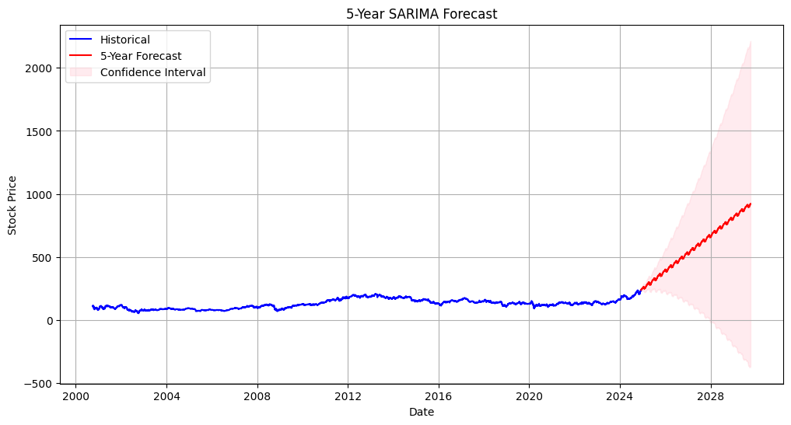

#### Project Overview
This project implements a systematic approach to stock price forecasting and algorithmic trading using IBM stock data. The workflow integrates time series analysis with advanced forecasting techniques and trading strategies to optimize profitability. The project focuses on identifying profitable trading windows through moving averages and enhancing the prediction of stock price movements using Kalman filters.

---

#### Key Features

1. **Stationarity Testing**:
   - The Augmented Dickey-Fuller (ADF) test is used to evaluate the stationarity of the time series data.
   - Differencing techniques are applied to transform the data into a stationary series for ARIMA modeling.

2. **Seasonality and Trend Analysis**:
   - Seasonal decomposition of the time series (multiplicative model) highlights quarterly earnings seasonality.
   - Auto-Correlation Function (ACF) and Partial Auto-Correlation Function (PACF) plots assist in identifying ARIMA parameters.

3. **SARIMA Model for Forecasting**:
   - Seasonal ARIMA (SARIMA) modeling captures both seasonal and non-seasonal components:
     - **Non-seasonal orders (p, d, q)**: Identified through ADF tests and differencing.
     - **Seasonal orders (P, D, Q, M)**: Based on seasonal differencing and ACF/PACF interpretation.
   - Produces a 5-year stock price forecast with confidence intervals.

   

4. **Moving Average-Based Trading**:
   - Supports **Simple Moving Average (SMA)** and **Exponential Moving Average (EMA)** methodologies for trend analysis.
   - Dynamically calculates short-term and long-term moving averages for trading decisions.

5. **Signal Detection**:
   - Buy and sell signals are generated based on moving average crossovers:
     - **Buy Signal**: Short-term moving average crosses above the long-term moving average.
     - **Sell Signal**: Short-term moving average crosses below the long-term moving average.

6. **Profitability Optimization**:
   - Optimizes trading parameters (short-term and long-term window sizes) for maximum profitability.
   - Uses a grid search across parameter ranges to identify the best combination of moving average windows.

   
   

7. **Kalman Smoothing**:
   - Employs Kalman filter-smoothed stock prices for additional analysis.
   - Compares results between raw data and Kalman-smoothed prices to evaluate trading performance.

   

8. **Simulation and Execution**:
   - Executes trades based on detected signals.
   - Tracks cumulative profits, portfolio size, and individual trade performance.

9. **Comparison of SMA, EMA, and Kalman Approaches**:
   - Evaluates and compares trading strategies using SMA, EMA, and Kalman-smoothed prices.
   - Reports profitability for each method.

---

#### Implementation Details

1. **Stationarity and Seasonal Analysis**:
   - Conduct Augmented Dickey-Fuller (ADF) test:
     ```python
     adfuller_test(stock_series_reduced)
     ```
   - Apply differencing to achieve stationarity:
     ```python
     stock_series_diff = stock_series_reduced.diff().dropna()
     adfuller_test(stock_series_diff)
     ```
   - Decompose time series data to visualize seasonal components:
     ```python
     decomposition = seasonal_decompose(stock_series_reduced.tail(726), model='multiplicative', period=63)
     decomposition.plot()
     ```

2. **SARIMA Modeling**:
   - Define parameters and fit the SARIMA model:
     ```python
     p, d, q = 0, 1, 0
     P, D, Q, M = 1, 1, 0, 63
     model = SARIMAX(stock_series_reduced, order=(p, d, q), seasonal_order=(P, D, Q, M))
     results = model.fit()
     print(results.summary())
     ```
   - Generate a 5-year forecast:
     ```python
     steps = 252 * 5  # 1260 steps
     forecast = results.get_forecast(steps=steps)
     forecast_mean = forecast.predicted_mean
     ```

   

3. **Trading Strategy Optimization**:
   - Optimize short-term and long-term window sizes:
     ```python
     optimize_parameters(stock_data, range(150, 190, 10), range(300, 450, 30), method="EMA")
     ```
   - Evaluate performance with SMA, EMA, and Kalman-smoothing:
     ```python
     optimized_profit_sma, best_short_window_sma, best_long_window_sma = optimize_parameters(stock_data, ...)
     optimized_profit_kalman, best_short_window_kalman, best_long_window_kalman = optimize_parameters(kalman_smoothed_prices, ...)
     ```

4. **Trading Execution and Visualization**:
   - Execute trades based on optimized parameters:
     ```python
     data_sma = trading_scheme(stock_data, best_short_window_sma, best_long_window_sma, method="SMA")
     ```
   - Visualize trading results:
     ```python
     plot_trading_results(data_sma, "Optimized Trading Results (SMA)")
     ```

---

#### Requirements

1. **Libraries**:
   - `numpy`
   - `pandas`
   - `matplotlib`
   - `tqdm`
   - `statsmodels`
   - `scipy`

2. **Data**:
   - IBM stock data (raw and Kalman-smoothed).

3. **Environment**:
   - Jupyter Notebook or Python 3.9+ environment with required dependencies installed.

---

#### Contributions

This project demonstrates:
- The integration of time series analysis and algorithmic trading.
- Optimization of trading strategies using statistical tools and machine learning techniques.
- Insights into financial forecasting and systematic trading approaches.

--- 